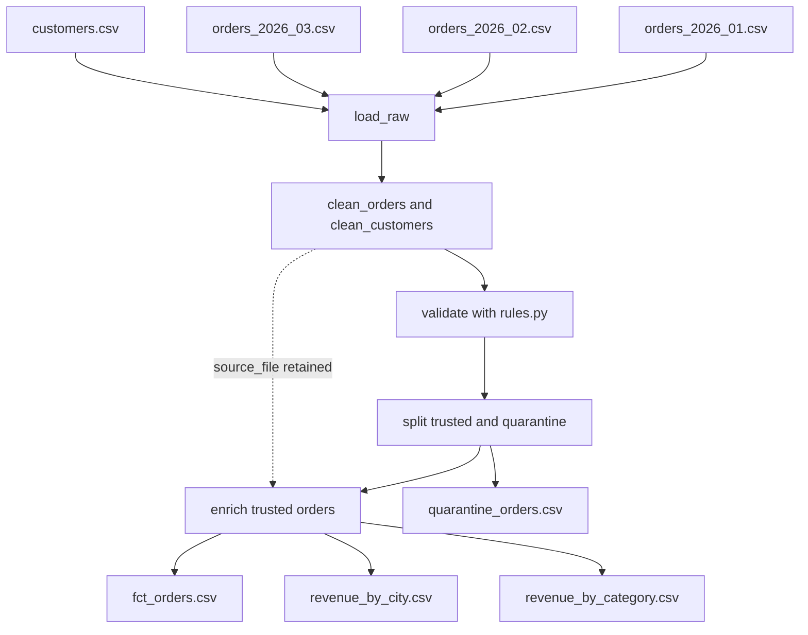

# Pipeline lineage

```mermaid
flowchart TD
    A[orders_2026_01.csv] --> D[load_raw]
    B[orders_2026_02.csv] --> D
    C[orders_2026_03.csv] --> D
    X[customers.csv] --> D
    D --> E[clean_orders and clean_customers]
    E --> F[validate with rules.py]
    F --> G[split trusted and quarantine]
    G --> H[enrich trusted orders]
    H --> I[fct_orders.csv]
    G --> J[quarantine_orders.csv]
    H --> K[revenue_by_city.csv]
    H --> L[revenue_by_category.csv]
    E -. source_file retained .-> H
```

The `extras/orders_2026_04.csv` file is kept as a test input and is not included in the normal `data/raw/` run.
